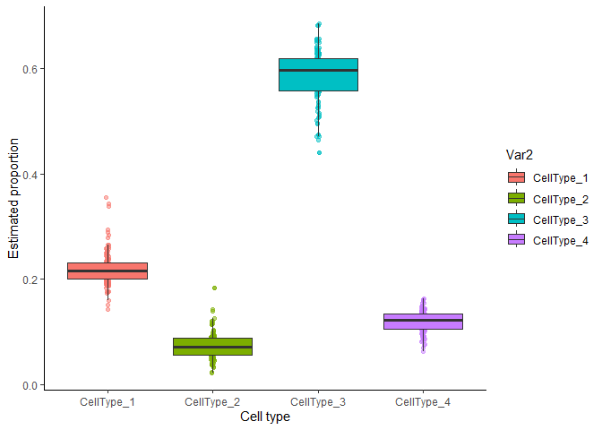
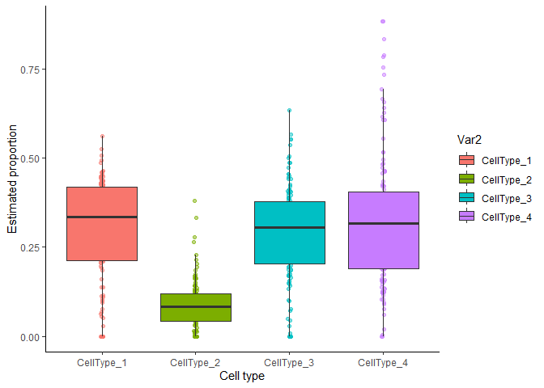
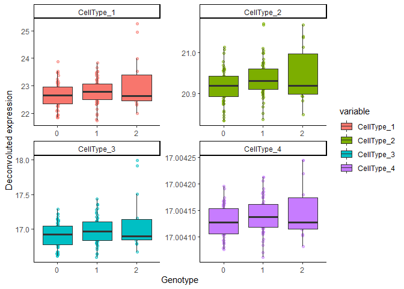
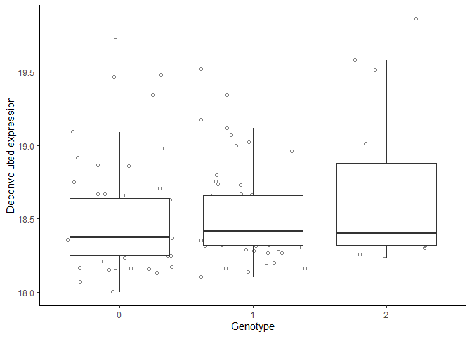
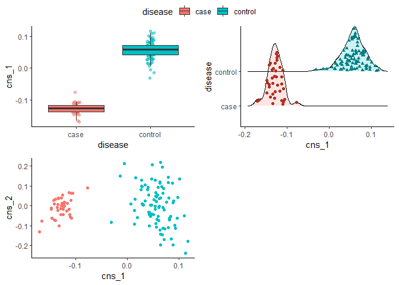
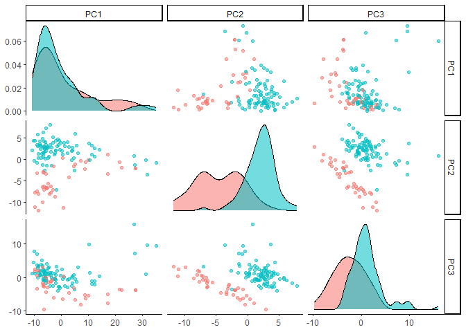
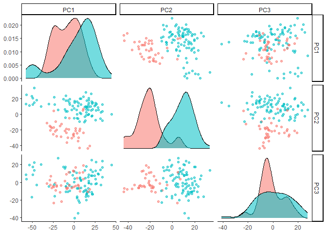
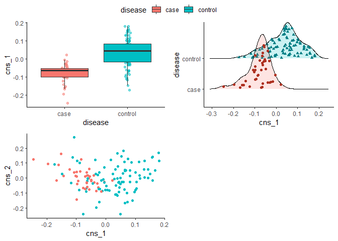

MICSQTL: multi-omic deconvolution, integration, and cell-type-specific Quantitative Trait Loci
================

MICSQTL (Multi-omic deconvolution, Integration and Cell-type-specific Quantitative Trait Loci) is a tool that estimates cell type proportions in bulk proteomes by borrowing information in matched transcriptomes. Based on the deconvoluted cell fractions, MICSQTL further integrates and visualizes multi-source profiles at bulk or cell type levels, as well as performs Quantitative Trait Loci mapping at cellular resolution. 

Figure1

# Install

``` r
devtools::install_github("YuePan027/mcQTL")
library(mcQTL)
library(ggplot2)
library(GGally)
```

# Quick start

A `SummarizedExperiment` object with bulk protein and/or gene expression
contained in `counts` slot, and a “signature matrix” which serves as a
reference of known cell type markers contained as an element in
`metadata` slot is required as input file. Note that the proteins or
genes in signature matrix should be a subset of the features in `counts`.

``` r
se <- SummarizedExperiment(assays = list(protein = mcQTL::protein_data),
                           rowData = mcQTL::anno_protein)
metadata(se) <- list(sig_protein = mcQTL::ref_protein,
                     sig_gene = mcQTL::ref_gene,gene_data=mcQTL::gene_data)
``` 

## Cell-type proportion deconvolution

This step estimates cell type proportions per molecule type.

In this current version, only `CIBERSORT` and `nnls` are supported as single-source deconvolution methods.

``` r
se <- deconv(se, source = 'protein',method = "cibersort")
```

This step might take a while if there are many proteins or genes
in the signature matrix. The cell-type proportion estimates for each
sample will be stored as an element (`prop`) in `metadata` slot.

``` r
head(se@metadata$prop)
#>          CellType_1 CellType_2 CellType_3 CellType_4
#> Sample_1  0.1951604 0.06448371  0.6080361  0.1323198
#> Sample_2  0.2076343 0.08769245  0.5896559  0.1150174
#> Sample_3  0.2312450 0.08167588  0.5581617  0.1289174
#> Sample_4  0.2658871 0.04509135  0.5675681  0.1214534
#> Sample_5  0.1993736 0.06795239  0.6104854  0.1221887
#> Sample_6  0.2233686 0.10127063  0.5485702  0.1267906

```

<!-- -->

Alternatively, if the cell-type proportions are pre-estimated or known 
from experiments, users can save that as an element (`prop`) in `metadata`  
and skip single-source deconvolution step. Note that the samples in the pre-estimated
cell-type proportions must match the samples from bulk protein/gene 
expression data.


## Cross-source cell-type proportion deconvolution 

The pure cell proteomics reference matrix may be lacking due to the limitations 
in single cell proteomics technologies. Here, we provide cross-source cell-type fraction
deconvolution based on matched bulk transcriptome-proteome. In
the example below, we show how to estimate protein proportions by borrowing 
information from deconvoluted transcriptomes. 

``` r
prop_gene <- mcQTL::prop_gene
set.seed(1234)
in_example <- sample(1:nrow(mcQTL::protein_data), size=500, replace =F)
example_mrk <- rownames(mcQTL::protein_data)[in_example]
se <- cross_prop(se, ini_prop = prop_gene, mrk_prot = example_mrk)
```

<!-- -->

## TCA tensor deconvolution 

The cell-type-specific expression per bulk sample can be predicted
using `TCA` deconvolution method given cellular composition (stored as
`prop` in `metadata`). The output will be stored as an element
(`TCA_deconv`) in `metadata` slot. It is a list with the length of the
number of cell types (same as cell types in `prop` in `metadata` slot).
Each element stores a deconvoluted protein expression per bulk sample.
Below is an example to check the deconvoluted cellular expression for
the first cell type (restricted to first 5 proteins and first 5
samples):

``` r
se <- TCA_deconv(se)
se@metadata$TCA_deconv[["CellType_1"]][1:5,1:5]
#>           Sample_1 Sample_2 Sample_3 Sample_4 Sample_5
#> Protein_1 17.34050 17.25571 16.95043 17.10952 17.19912
#> Protein_2 16.29749 15.69840 15.41563 16.35809 15.22627
#> Protein_3 21.94181 21.56862 21.83713 22.13330 21.00002
#> Protein_4 18.66681 18.89659 18.64090 18.49830 17.90457
#> Protein_5 18.43079 18.61064 18.32749 17.61362 18.23966
```

The figure below shows the cell-type-specific differential expression in an example `Protein_6`.


<!-- -->

Such patterns may not be profound at bulk level.


<!-- -->

# Integrative analysis

AJIVE (Angle based Joint and Individual Variation Explained) is useful
when there are multiple data matrices measured on the same set of
samples. It decomposes each data matrix as three parts: (1) Joint
variation across data types (2) Individual structured variation for each
data type and (3) Residual noise.

It is similar as principal component analysis (PCA), but principal
component analysis only takes a single data set and decomposes it into
modes of variation that maximize variation. AJIVE finds joint modes of
variation from multiple data sources.

Common normalized scores are one of the desirable output to explore the
joint behavior that is shared by different data sources. Below we show
the visualization of common normalized scores. It is clear that the
disease status of these samples are well separated by the first common
normalized scores.

``` r
se@metadata$meta <- mcQTL::meta
se <- ajive_decomp(se)
cns_plot(se, score = "cns_1", group_var = "disease", 
         scatter = T, scatter_x = "cns_1", scatter_y = "cns_2")
```

<!-- -->

## Comparison to PCA

``` r
pca_res <- prcomp(t(assay(se)), rank. = 3, scale. = F)
pca_res_protein <- data.frame(pca_res[["x"]])
pca_res_protein <- cbind(pca_res_protein, mcQTL::meta$disease)
colnames(pca_res_protein)[4] = 'disease'
GGally::ggpairs(pca_res_protein, columns = 1:3, aes(color = disease, alpha = 0.5),
        upper = list(continuous = "points")) + theme_classic()
```

<!-- -->

``` r


pca_res <- prcomp(t(se@metadata$gene_data), rank. = 3, scale. = F)
pca_res_gene <- data.frame(pca_res[["x"]])
pca_res_gene <- cbind(pca_res_gene, mcQTL::meta$disease)
colnames(pca_res_gene)[4] = 'disease'
GGally::ggpairs(pca_res_gene, columns = 1:3, aes(color = disease, alpha = 0.5),
        upper = list(continuous = "points")) + theme_classic()
```

<!-- -->

## Cell-type-specific AJIVE

The integrative analysis can also be done at cell-type-specific level.
TCA deconvolution for the secondary data set is required. Here, we
deconvolute gene expression in additional to protein expression and
restrict to the first cell type as an illustration example.

``` r
se <- TCA_deconv(se, test = "gene_data", prop = mcQTL::prop_gene)
se <- ajive_decomp(se, level = "CellType_1")
cns_plot(se, score = "cns_1", group_var = "disease", 
         scatter = T, scatter_x = "cns_1", scatter_y = "cns_2")
```

<!-- -->


## Feature filtering

The feature filtering can be applied at both proteins/genes and SNPs.
This step is optional but highly recommended to filter out some features
that are not very informative or do not make much sense biologically.
Note that this function is required to run even no filtering is expected
to be done (just set `filter_method = "null"`) to obtain a consistent
object format for downstream analysis.

To apply feature filtering, annotation files for protein/gene and SNPs
are required. The annotation file for proteins/genes should be stored in
`rowData()`, where each row corresponds to a protein/gene with it’s
symbol as row names. The first column should be a character vector
indicating which chromosome each protein or gene is on. In addition, it
should contain at least a “Start” column with numeric values indicating
the start position on that chromosome, a “End” column with numeric
values indicating the end position on that chromosome and a “Symbol”
column as a unique name for each protein or gene.

``` r
head(rowData(se))
#> DataFrame with 6 rows and 4 columns
#>                   Chr     Start       End      Symbol
#>           <character> <integer> <integer> <character>
#> Protein_1          15  67202823  67254631   Protein_1
#> Protein_2           6  44300549  44313323   Protein_2
#> Protein_3           7 122076491 122133726   Protein_3
#> Protein_4          16   8735739   8781427   Protein_4
#> Protein_5           9 104784317 104903679   Protein_5
#> Protein_6           9 137007931 137028140   Protein_6
```

The information from genetic variants should be stored in a P (the
number of SNP) by N (the number of samples, should match the sample in
`counts` slot) matrix contained as an element (`SNP_data`) in `metadata`
slot. Each matrix entry corresponds to the genotype group indicator (0
for 0/0, 1 for 0/1 and 2 for 1/1) for a sample at a genetic location.
The annotations of these SNP should be stored as an element (`anno_SNP`)
in `metadata` slot. It should include at least the following columns:
(1) “CHROM” (which chromosome the SNP is on); (2) “POS” (position of
that SNP) and (3) “ID” (a unique identifier for each SNP, usually a
combination of chromosome and its position).

The example SNP data provided here were restricted to chromosome 9 only.
In practice, the SNPs may from multiple or even all chromosomes.

``` r
se@metadata$SNP_data <- mcQTL::SNP_data
se@metadata$anno_SNP <- mcQTL::anno_SNP
head(se@metadata$anno_SNP)
#>        CHROM       POS          ID
#> 237392     9 104596634 9:104596634
#> 106390     9  28487163  9:28487163
#> 304108     9 126307371 9:126307371
#> 295846     9 122787821 9:122787821
#> 126055     9  33975396  9:33975396
#> 342900     9 140300675 9:140300675
```

For filtering at protein or gene level, only those symbols contained in
`target_protein` argument will be kept for csQTL analysis in the next
step. By default, all proteins or genes will be used.

For filtering at SNP level, there are three options: (1) only those
symbols contained in `target_SNP` argument will be kept and if not
provided, all SNPs will be used for further filtering; (2) filter out
the SNPs that have minor allele frequency below the threshold defined by
`filter_allele` argument (`filter_method = "allele"`) and (3) restrict
to cis-regulatory variants (`filter_method = "distance"`): the SNPs up
to 1 Mb proximal to the start of the gene.

The results after filtering will be stored as an element
(`choose_SNP_list`) in `metadata` slot. It is a list with the length of
the number of proteins for downstream analysis. Each element stores the
index of SNPs to be tested for corresponding protein. The proteins with
no SNPs correspond to it will be removed from the returned list.

To simplify the analysis, we only kept 10 targeted proteins from
chromosome 9 as an example.

``` r
target_protein <- rowData(se)[rowData(se)$Chr == 9,][1:10, "Symbol"]
se <- feature_filter(se, target_protein = target_protein, 
                     filter_method = c("allele", "distance"), 
                     filter_allele = 0.25,
                     filter_geno = 0.05,
                     ref_position = "TSS")           
#> Filter SNP based on distance for protein Protein_261
#> Filter SNP based on distance for protein Protein_241
#> Filter SNP based on distance for protein Protein_238
#> Filter SNP based on distance for protein Protein_131
#> Filter SNP based on distance for protein Protein_93
#> Filter SNP based on distance for protein Protein_88
#> Filter SNP based on distance for protein Protein_79
#> Filter SNP based on distance for protein Protein_6
#> Filter SNP based on distance for protein Protein_5
#> Filter SNP based on distance for protein Protein_283
```

In this example, only 20 SNPs are kept for the first target protein and
only 20 SNPs are kept for the second target protein.

``` r
unlist(lapply(se@metadata$choose_SNP_list, length))
#>   Protein_5   Protein_6  Protein_79  Protein_88  Protein_93 Protein_238 
#>          24          17           6           9           7          13 
#> Protein_241 Protein_261 Protein_283 
#>          19          13          14
```

## csQTL analysis

In this step, the `TOAST` method is implemented for cell-type-specific
differential expression analysis based on samples’ genotype.

The result will be stored as an element (`TOAST_output`) in `metadata`
slot. It is a list with the same length as tested proteins or genes
where each element consists of a table including protein or gene symbol,
SNP ID and p-values from each cell type. A significant p-value indicates
that the protein or gene expression is different among the sample from
different genotype groups.

``` r
system.time(se <- csQTL(se))
#> csQTL test for protein Protein_5 
#> csQTL test for protein Protein_6 
#> csQTL test for protein Protein_79 
#> csQTL test for protein Protein_88 
#> csQTL test for protein Protein_93 
#> csQTL test for protein Protein_238 
#> csQTL test for protein Protein_241 
#> csQTL test for protein Protein_261 
#> csQTL test for protein Protein_283
```

We can check the results from csQTL analysis for the first target
protein by calling:

``` r
head(se@metadata$TOAST_output[[1]])
#>     protein         SNP CellType_1 CellType_2 CellType_3  CellType_4
#> 1 Protein_5 9:104596634  0.8584834  0.6213491 0.02948925 0.026916167
#> 2 Protein_5 9:104702846  0.3603352  0.4546099 0.23180750 0.274621681
#> 3 Protein_5 9:104294530  0.8099764  0.2853652 0.37908667 0.002722494
#> 4 Protein_5 9:104868031  0.3470749  0.7339064 0.70919458 0.996376197
#> 5 Protein_5 9:105077464  0.3458041  0.5438837 0.56463631 0.797753630
#> 6 Protein_5 9:105655745  0.2276617  0.3832784 0.36864555 0.746866829
```
