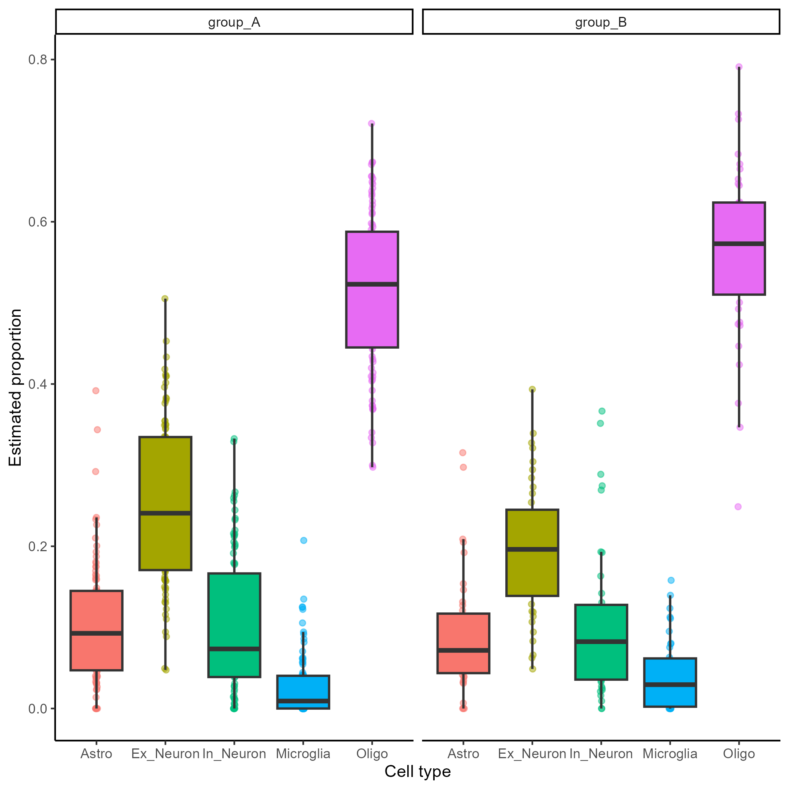
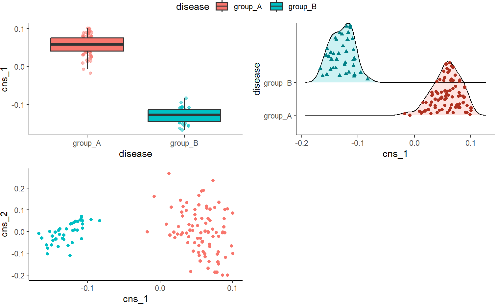
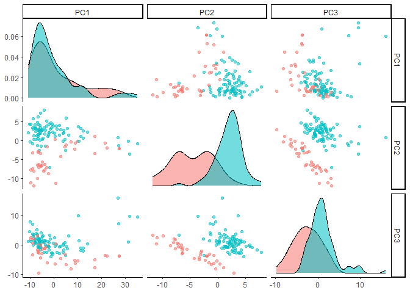
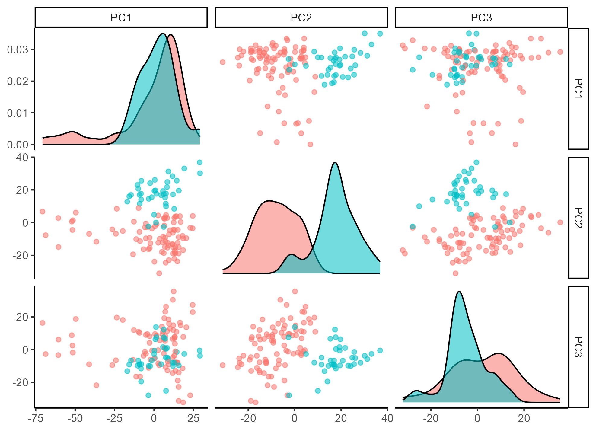

MICSQTL: Multi-omic deconvolution, Integration and Cell-type-specific
Quantitative Trait Loci
================

# Introduction

Our pipeline, `MICSQTL`, integrates RNA and protein expressions to detect potential cell marker proteins and estimate cell abundance in mixed proteomes without a reference signature matrix. `MICSQTL` enables cell-type-specific quantitative trait loci (QTL) mapping for proteins or transcripts using bulk expression data and estimated cellular composition per molecule type, eliminating the necessity for single-cell sequencing. We use matched transcriptome-proteome from human brain frontal cortex tissue samples to demonstrate the input and output of our tool.
This pipeline enables valuable insights into cellular composition, facilitates cell-type-specific protein QTL mapping, and streamlines multi-modal data integration and dimension reduction.


## Install

``` r
# Install
# options(download.file.method = "wininet")
# devtools::install_github("YuePan027/MICSQTL")
library(MICSQTL)
library(reshape2)
library(RColorBrewer)
library(GGally)
library(ggplot2)
```

# Quick start

A `SummarizedExperiment` object with bulk protein and/or gene expression
contained in `counts` slot, and a “signature matrix” which serves as a
reference of known cell type markers contained as an element in
`metadata` slot is required as input file. We recommend including
important marker proteins or genes in the signature matrix to obtain
more reliable results.

In this package, we provide an example `SummarizedExperiment` object
containing the following elements:

-   protein_data: A subset of proteomic data PsychENCODE with 2242 rows
    (protein) and 127 columns (sample).

-   anno_protein: A data frame with 2242 rows and 4 columns (Chr, Start,
    End, Symbol) as annotations of each protein from `protein_data`.

-   ref_protein: A signature matrix with 2242 rows (protein) and 4
    columns (cell types), which serves as a reference of known cellular
    signatures.

-   gene_data: A data frame with 2867 rows (genes) and 127 columns
    (sample).

-   ref_gene: A signature matrix with 4872 rows (genes) and 5 columns
    (cell types), which serves as a reference of known cellular
    signatures.

-   prop_gene: A pre-defined deconvoluted transcriptome proportion
    matrix.

-   SNP_data: A sparse matrix with 2000 rows (SNP), which stores the
    information of genetic variants at each location from one chromosome
    and 127 columns (sample, should match the sample in `protein_data`).
    Each matrix entry corresponds to the genotype group indicator (0, 1
    or 2) for a sample at a genetic location.

-   anno_SNP: A data frame with 2000 rows and 3 columns (CHROM, POS,
    ID), which stores Annotations of each SNP from `SNP_data`.

-   meta:A data frame with 127 rows (sample) and 2 columns (disease
    status and gender) as metadata.

-   cell_counts: A matrix containing cell counts across multiple subjects, 
    where subjects are represented as rows and cell types as columns. Each entry 
    (i, j) in the matrix indicates the count of cells belonging to the ith 
    subject and jth cell type.

``` r
data(se)
```

## Cell-type proportion deconvolution

This step estimates cell type proportions per molecule type.

In this current version, only `nnls` is supported as single-source
deconvolution methods.

Alternatively, if there are cell-type proportion estimates results
generated using other methods or obtained from other sources, just save
that as an element (`prop`) in `metadata` slot and this deconvolution
step can be skipped. Note that the samples in the cell-type proportion
estimates must match the samples from bulk protein expression data.

## Cross-source cell-type proportion deconvolution

The reference matrix for pure cell proteomics may be incomplete due to the limitations of single-cell proteomics technologies. To address this, we propose a novel cross-source cell-type fraction deconvolution method (Joint-AJ-RF) that leverages matched bulk transcriptome-proteome data. In the following example, we demonstrate how to estimate protein proportions by utilizing information from deconvoluted transcriptomes.

This method requires an external reference with cell counts from a similar tissue type (usually from small-scale single-cell or flow cytometry experiments). We provide a sample cell counts table in the metadata for illustration; however, in practice, it should be sourced from a matching tissue type.

The `ajive_decomp` function (more on this in the following section) with `refactor_loading = TRUE` should be employed to improve joint deconvolution by performing cross-source feature selection for potential protein cell markers.

``` r
se <- ajive_decomp(se, use_marker = FALSE, refactor_loading = TRUE)
se <- deconv(se, source = "cross", method = "Joint",
                 use_refactor = 1000, cell_counts = se@metadata$cell_counts)
```

<!-- -->

An alternative approach involves a two-step process. First, obtain a sample-wise pre-defined deconvoluted transcriptome proportion and store as `prop_gene` in the `metadata` slot, use methods like CIBERSORT or MuSiC. Then, utilize the TCA algorithm (https://cran.r-project.org/web/packages/TCA/index.html) to calculate protein proportion estimates.

## Integrative analysis

AJIVE (Angle based Joint and Individual Variation Explained) is useful
when there are multiple data matrices measured on the same set of
samples. It decomposes each data matrix as three parts: (1) Joint
variation across data types (2) Individual structured variation for each
data type and (3) Residual noise.

It is similar as principal component analysis (PCA), but principal
component analysis only takes a single data set and decomposes it into
modes of variation that maximize variation. AJIVE finds joint modes of
variation from multiple data sources.

Common normalized scores are one of the desirable output to explore the
joint behavior that is shared by different data sources. Below we show
the visualization of common normalized scores. It is clear that the
disease status of these samples are well separated by the first common
normalized scores.

``` r
se <- ajive_decomp(se, plot = TRUE,
                   group_var = "disease",
                   scatter = TRUE, scatter_x = "cns_1", scatter_y = "cns_2")
metadata(se)$cns_plot
```

<!-- -->

### Comparison to PCA

``` r
pca_res <- prcomp(t(assay(se)), rank. = 3, scale. = FALSE)
pca_res_protein <- data.frame(pca_res[["x"]])
pca_res_protein <- cbind(pca_res_protein, slot(se, "metadata")$meta$disease)
colnames(pca_res_protein)[4] <- "disease"
ggpairs(pca_res_protein,
    columns = seq_len(3), aes(color = disease, alpha = 0.5),
    upper = list(continuous = "points")
) + theme_classic()
```

<!-- -->

``` r
pca_res <- prcomp(t(slot(se, "metadata")$gene_data), rank. = 3, scale. = FALSE)
pca_res_gene <- data.frame(pca_res[["x"]])
pca_res_gene <- cbind(pca_res_gene, slot(se, "metadata")$meta$disease)
colnames(pca_res_gene)[4] <- "disease"
ggpairs(pca_res_gene,
    columns = seq_len(3), aes(color = disease, alpha = 0.5),
    upper = list(continuous = "points")
) + theme_classic()
```

<!-- -->

## Feature filtering

The feature filtering can be applied at both proteins/genes and SNPs.
This step is optional but highly recommended to filter out some features
that are not very informative or do not make much sense biologically.
Note that this function is required to run even no filtering is expected
to be done (just set `filter_method = "null"`) to obtain a consistent
object format for downstream analysis.

To apply feature filtering, annotation files for protein/gene and SNPs
are required. The annotation file for proteins/genes should be stored in
`rowData()`, where each row corresponds to a protein/gene with it’s
symbol as row names. The first column should be a character vector
indicating which chromosome each protein or gene is on. In addition, it
should contain at least a “Start” column with numeric values indicating
the start position on that chromosome, a “End” column with numeric
values indicating the end position on that chromosome and a “Symbol”
column as a unique name for each protein or gene.

``` r
head(rowData(se))
#> DataFrame with 6 rows and 4 columns
#>               Chr     Start       End      Symbol
#>       <character> <integer> <integer> <character>
#> AAGAB          15  67202823  67254631       AAGAB
#> AARS2           6  44300549  44313323       AARS2
#> AASS            7 122076491 122133726        AASS
#> ABAT           16   8735739   8781427        ABAT
#> ABCA1           9 104784317 104903679       ABCA1
#> ABCA2           9 137007931 137028140       ABCA2
```

The information from genetic variants should be stored in a P (the
number of SNP) by N (the number of samples, should match the sample in
`counts` slot) matrix contained as an element (`SNP_data`) in `metadata`
slot. Each matrix entry corresponds to the genotype group indicator (0
for 0/0, 1 for 0/1 and 2 for 1/1) for a sample at a genetic location.
The annotations of these SNP should be stored as an element (`anno_SNP`)
in `metadata` slot. It should include at least the following columns:
(1) “CHROM” (which chromosome the SNP is on); (2) “POS” (position of
that SNP) and (3) “ID” (a unique identifier for each SNP, usually a
combination of chromosome and its position).

The example SNP data provided here were restricted to chromosome 9 only.
In practice, the SNPs may from multiple or even all chromosomes.

``` r
head(slot(se, "metadata")$anno_SNP)
#>        CHROM       POS          ID
#> 332373     9 137179658 9:137179658
#> 237392     9 104596634 9:104596634
#> 106390     9  28487163  9:28487163
#> 304108     9 126307371 9:126307371
#> 295846     9 122787821 9:122787821
#> 126055     9  33975396  9:33975396
```

For filtering at protein or gene level, only those symbols contained in
`target_SNP` argument will be kept and if not provided, all SNPs will be
used for further filtering.

For filtering at SNP level, there are three options: (1) filter out the
SNPs that have minor allele frequency below the threshold defined by
`filter_allele` argument (`filter_method = "allele"`); (2) filter out
the SNPs that the fraction of samples in the smallest genotype group
below the threshold defined by `filter_geno` argument
(`filter_method = "allele"`) and (3) restrict to cis-regulatory variants
(`filter_method = "distance"`): the SNPs up to 1 Mb proximal to the
start of the gene. Both filtering methods can be applied simultaneously
by setting `filter_method = c("allele", "distance")`.

The results after filtering will be stored as an element
(`choose_SNP_list`) in `metadata` slot. It is a list with the length of
the number of proteins for downstream analysis. Each element stores the
index of SNPs to be tested for corresponding protein. The proteins with
no SNPs correspond to it will be removed from the returned list.

To simplify the analysis, we only test 3 targeted proteins from
chromosome 9 as an example.

``` r
target_protein <- rowData(se)[rowData(se)$Chr == 9, ][seq_len(3), "Symbol"]
se <- feature_filter(se,
    target_protein = target_protein,
    filter_method = c("allele", "distance"),
    filter_allele = 0.15,
    filter_geno = 0.05,
    ref_position = "TSS"
)
#> Filter SNP based on distance for protein ABCA2
#> Filter SNP based on distance for protein ABCA1
#> Filter SNP based on distance for protein AGTPBP1
```

In this example, the number of SNPs corresponding to each protein after
filtering ranges from 7 to 26.

``` r
unlist(lapply(slot(se, "metadata")$choose_SNP_list, length))
#>   ABCA1   ABCA2 AGTPBP1 
#>      26      22       7
```

## csQTL analysis

In this step, the `TOAST` method is implemented for cell-type-specific
differential expression analysis based on samples’ genotype.

The result will be stored as an element (`TOAST_output`) in `metadata`
slot. It is a list with the same length as tested proteins or genes
where each element consists of a table including protein or gene symbol,
SNP ID and p-values from each cell type. A significant p-value indicates
that the protein or gene expression is different among the sample from
different genotype groups.

``` r
system.time(se <- csQTL(se))
#> csQTL test for protein ABCA1
#> csQTL test for protein ABCA2
#> csQTL test for protein AGTPBP1
#>    user  system elapsed 
#>    1.65    0.89  154.30
```

We can check the results from csQTL analysis for one of target proteins:

``` r
res <- slot(se, "metadata")$TOAST_output[[2]]
head(res[order(apply(res, 1, min)), ])
#>    protein         SNP      Astro   ExNeuron   InNeuron        Micro
#> 20   ABCA2 9:137341600 0.79285955 0.30763334 0.98265834 3.269529e-01
#> 8    ABCA2 9:136417159 0.44438506 0.34552330 0.84110974 7.881551e-01
#> 12   ABCA2 9:137238626 0.95156516 0.57109961 0.04382715 1.155626e-02
#> 1    ABCA2 9:137179658 0.91303086 0.20309228 0.04625565 3.962209e-05
#> 6    ABCA2 9:136950118 0.91123211 0.04722635 0.13748034 6.596898e-01
#> 16   ABCA2 9:136630751 0.05187403 0.47704608 0.63004912 4.619814e-03
#>          Oligo
#> 20 0.007780449
#> 8  0.039815389
#> 12 0.694488671
#> 1  0.108280025
#> 6  0.130649793
#> 16 0.163604428
```

# Licenses of the analysis methods

| method                                                                 | citation                                                                                                                                                              |
|------------------------------------------------------------------------|-----------------------------------------------------------------------------------------------------------------------------------------------------------------------|
| [TCA](https://cran.r-project.org/web/packages/TCA/index.html)          | Rahmani, Elior, et al. “Cell-type-specific resolution epigenetics without the need for cell sorting or single-cell biology.” Nature communications 10.1 (2019): 3417. |
| [AJIVE](https://github.com/idc9/r_jive)                                | Feng, Qing, et al. “Angle-based joint and individual variation explained.” Journal of multivariate analysis 166 (2018): 241-265.                                      |
| [TOAST](http://bioconductor.org/packages/release/bioc/html/TOAST.html) | Li, Ziyi, and Hao Wu. “TOAST: improving reference-free cell composition estimation by cross-cell type differential analysis.” Genome biology 20.1 (2019): 1-17.       |
