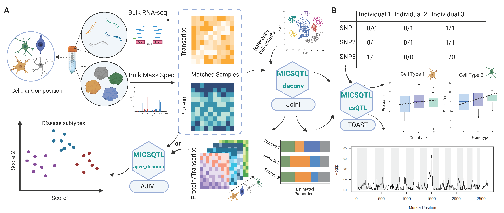

MICSQTL: Multi-omic deconvolution, Integration and Cell-type-specific
Quantitative Trait Loci
================
truetrue

# Introduction

Our pipeline, `MICSQTL`, utilizes scRNA-seq reference and bulk
transcriptomes to estimate cellular composition in the matched bulk
proteomes. The expression of genes and proteins at either bulk level or
cell type level can be integrated by Angle-based Joint and Individual
Variation Explained (AJIVE) framework. Meanwhile, `MICSQTL` can perform
cell-type-specic quantitative trait loci (QTL) mapping to proteins or
transcripts based on the input of bulk expression data and the estimated
cellular composition per molecule type, without the need for single cell
sequencing. We use matched transcriptome-proteome from human brain
frontal cortex tissue samples to demonstrate the input and output of our
tool.



# Install

``` r
# Install
#options(download.file.method = "wininet")
#devtools::install_github("YuePan027/MICSQTL")
library(MICSQTL)
packages <- c("GGally", "reshape2", "ggplot2", "RColorBrewer")
# Check if packages are installed, and if not, install them
for (package in packages) {
  if (!require(package, character.only = TRUE)) {
    install.packages(package)
    library(package, character.only = TRUE)
  }
}
```

# Quick start

A `SummarizedExperiment` object with bulk protein and/or gene expression
contained in `counts` slot, and a “signature matrix” which serves as a
reference of known cell type markers contained as an element in
`metadata` slot is required as input file. We recommend including
important marker proteins or genes in the signature matrix to obtain
more reliable results.

``` r
se <- SummarizedExperiment(assays = list(protein = MICSQTL::protein_data),
                           rowData = MICSQTL::anno_protein)
metadata(se) <- list(sig_protein = MICSQTL::ref_protein,
                     sig_gene = MICSQTL::ref_gene, 
                     gene_data = MICSQTL::gene_data,
                     meta = MICSQTL::meta)
```

## Cell-type proportion deconvolution

This step estimates cell type proportions per molecule type.

In this current version, only `CIBERSORT` and `nnls` are supported as
single-source deconvolution methods.

``` r
se <- deconv(se, source='protein', method = "cibersort")
```

This step might take a while if there are many features in the signature
matrix. The cell-type proportion estimates for each sample will be
stored as an element (`prop`) in `metadata` slot.

``` r
head(se@metadata$prop)
#>               Astro      Micro    Neuron     Oligo
#> 2014_2194 0.1859424 0.06142760 0.6216158 0.1310142
#> 2014_2195 0.2041841 0.10161331 0.5915177 0.1026848
#> 2014_2200 0.2129030 0.07862809 0.5673769 0.1410921
#> 2014_2622 0.2660539 0.05860571 0.5737932 0.1015472
#> 2014_2625 0.1938783 0.07005880 0.6028512 0.1332117
#> 2015_1    0.2070628 0.10253712 0.5513774 0.1390227
```

<!-- -->

Alternatively, if there are cell-type proportion estimates results
generated using other methods or obtained from other sources, just save
that as an element (`prop`) in `metadata` slot and this deconvolution
step can be skipped. Note that the samples in the cell-type proportion
estimates must match the samples from bulk protein expression data.

## Cross-source cell-type proportion deconvolution (optional)

The pure cell proteomics reference matrix may be lacking due to the
limitations in single cell proteomics technologies. Here, we provide
cross-source cell-type fraction deconvolution based on matched bulk
transcriptome-proteome. In the example below, we show how to estimate
protein proportions by borrowing information from deconvoluted
transcriptomes.

``` r
se <- deconv(se, source='cross', method = "cibersort")
#> INFO [2023-04-21 12:22:24] Starting tca...
#> INFO [2023-04-21 12:22:24] Validating input...
#> INFO [2023-04-21 12:22:24] Starting re-estimation of W...
#> INFO [2023-04-21 12:22:24] Performing feature selection using refactor...
#> INFO [2023-04-21 12:22:24] Starting refactor...
#> INFO [2023-04-21 12:22:24] Running PCA on X using rand_svd == TRUE...
#> INFO [2023-04-21 12:22:24] Computing a low rank approximation of X...
#> INFO [2023-04-21 12:22:24] Calculating the distance of each feature from its low rank approximation...
#> INFO [2023-04-21 12:22:24] Computing the ReFACTor components based on the top 1345 features with lowest distances...
#> INFO [2023-04-21 12:22:24] Finished refactor.
#> INFO [2023-04-21 12:22:24] Fitting the TCA model using the selected features for re-estimating W...
#> INFO [2023-04-21 12:22:24] Iteration 1 out of 10 external iterations (fitting all parameters including W)...
#> INFO [2023-04-21 12:22:24] Fitting means and variances...
#> INFO [2023-04-21 12:22:24] Iteration 1 out of 10 internal iterations...
#> INFO [2023-04-21 12:22:25] Iteration 2 out of 10 internal iterations...
#> INFO [2023-04-21 12:22:25] Internal loop converged.
#> INFO [2023-04-21 12:22:25] Fitting W...
#> INFO [2023-04-21 12:22:30] Iteration 2 out of 10 external iterations (fitting all parameters including W)...
#> INFO [2023-04-21 12:22:30] Fitting means and variances...
#> INFO [2023-04-21 12:22:30] Iteration 1 out of 10 internal iterations...
#> INFO [2023-04-21 12:22:30] Iteration 2 out of 10 internal iterations...
#> INFO [2023-04-21 12:22:31] Iteration 3 out of 10 internal iterations...
#> INFO [2023-04-21 12:22:31] Internal loop converged.
#> INFO [2023-04-21 12:22:31] Fitting W...
#> INFO [2023-04-21 12:22:35] Iteration 3 out of 10 external iterations (fitting all parameters including W)...
#> INFO [2023-04-21 12:22:35] Fitting means and variances...
#> INFO [2023-04-21 12:22:35] Iteration 1 out of 10 internal iterations...
#> INFO [2023-04-21 12:22:35] Iteration 2 out of 10 internal iterations...
#> INFO [2023-04-21 12:22:36] Internal loop converged.
#> INFO [2023-04-21 12:22:36] Fitting W...
#> INFO [2023-04-21 12:22:39] Iteration 4 out of 10 external iterations (fitting all parameters including W)...
#> INFO [2023-04-21 12:22:39] Fitting means and variances...
#> INFO [2023-04-21 12:22:39] Iteration 1 out of 10 internal iterations...
#> INFO [2023-04-21 12:22:40] Iteration 2 out of 10 internal iterations...
#> INFO [2023-04-21 12:22:40] Internal loop converged.
#> INFO [2023-04-21 12:22:40] Fitting W...
#> INFO [2023-04-21 12:22:44] External loop converged.
#> INFO [2023-04-21 12:22:44] Calculate p-values for deltas and gammas.
#> INFO [2023-04-21 12:22:45] Fitting the TCA model given the updated W...
#> INFO [2023-04-21 12:22:45] Fitting means and variances...
#> INFO [2023-04-21 12:22:45] Iteration 1 out of 10 internal iterations...
#> INFO [2023-04-21 12:22:46] Iteration 2 out of 10 internal iterations...
#> INFO [2023-04-21 12:22:46] Iteration 3 out of 10 internal iterations...
#> INFO [2023-04-21 12:22:47] Internal loop converged.
#> INFO [2023-04-21 12:22:47] Calculate p-values for deltas and gammas.
#> INFO [2023-04-21 12:22:48] Finished tca.
```

<!-- -->

## Integrative analysis

AJIVE (Angle based Joint and Individual Variation Explained) is useful
when there are multiple data matrices measured on the same set of
samples. It decomposes each data matrix as three parts: (1) Joint
variation across data types (2) Individual structured variation for each
data type and (3) Residual noise.

It is similar as principal component analysis (PCA), but principal
component analysis only takes a single data set and decomposes it into
modes of variation that maximize variation. AJIVE finds joint modes of
variation from multiple data sources.

Common normalized scores are one of the desirable output to explore the
joint behavior that is shared by different data sources. Below we show
the visualization of common normalized scores. It is clear that the
disease status of these samples are well separated by the first common
normalized scores.

``` r
se <- ajive_decomp(se, use_marker = T)
cns_plot(se, score = "cns_1", group_var = "disease", 
         scatter = T, scatter_x = "cns_1", scatter_y = "cns_2")
#> Picking joint bandwidth of 0.00881
```

<!-- -->

### Comparison to PCA

``` r
pca_res <- prcomp(t(assay(se)), rank. = 3, scale. = F)
pca_res_protein <- data.frame(pca_res[["x"]])
pca_res_protein <- cbind(pca_res_protein, se@metadata$meta$disease)
colnames(pca_res_protein)[4] = 'disease'
GGally::ggpairs(pca_res_protein, columns = 1:3, aes(color = disease, alpha = 0.5),
        upper = list(continuous = "points")) + theme_classic()
```

<!-- -->

``` r


pca_res <- prcomp(t(se@metadata$gene_data), rank. = 3, scale. = F)
pca_res_gene <- data.frame(pca_res[["x"]])
pca_res_gene <- cbind(pca_res_gene, se@metadata$meta$disease)
colnames(pca_res_gene)[4] = 'disease'
GGally::ggpairs(pca_res_gene, columns = 1:3, aes(color = disease, alpha = 0.5),
        upper = list(continuous = "points")) + theme_classic()
```

<!-- -->

## Feature filtering

The feature filtering can be applied at both proteins/genes and SNPs.
This step is optional but highly recommended to filter out some features
that are not very informative or do not make much sense biologically.
Note that this function is required to run even no filtering is expected
to be done (just set `filter_method = "null"`) to obtain a consistent
object format for downstream analysis.

To apply feature filtering, annotation files for protein/gene and SNPs
are required. The annotation file for proteins/genes should be stored in
`rowData()`, where each row corresponds to a protein/gene with it’s
symbol as row names. The first column should be a character vector
indicating which chromosome each protein or gene is on. In addition, it
should contain at least a “Start” column with numeric values indicating
the start position on that chromosome, a “End” column with numeric
values indicating the end position on that chromosome and a “Symbol”
column as a unique name for each protein or gene.

``` r
head(rowData(se))
#> DataFrame with 6 rows and 4 columns
#>               Chr     Start       End      Symbol
#>       <character> <integer> <integer> <character>
#> AAGAB          15  67202823  67254631       AAGAB
#> AARS2           6  44300549  44313323       AARS2
#> AASS            7 122076491 122133726        AASS
#> ABAT           16   8735739   8781427        ABAT
#> ABCA1           9 104784317 104903679       ABCA1
#> ABCA2           9 137007931 137028140       ABCA2
```

The information from genetic variants should be stored in a P (the
number of SNP) by N (the number of samples, should match the sample in
`counts` slot) matrix contained as an element (`SNP_data`) in `metadata`
slot. Each matrix entry corresponds to the genotype group indicator (0
for 0/0, 1 for 0/1 and 2 for 1/1) for a sample at a genetic location.
The annotations of these SNP should be stored as an element (`anno_SNP`)
in `metadata` slot. It should include at least the following columns:
(1) “CHROM” (which chromosome the SNP is on); (2) “POS” (position of
that SNP) and (3) “ID” (a unique identifier for each SNP, usually a
combination of chromosome and its position).

The example SNP data provided here were restricted to chromosome 9 only.
In practice, the SNPs may from multiple or even all chromosomes.

``` r
se@metadata$SNP_data <- MICSQTL::SNP_data
se@metadata$anno_SNP <- MICSQTL::anno_SNP
head(se@metadata$anno_SNP)
#>        CHROM       POS          ID
#> 332373     9 137179658 9:137179658
#> 237392     9 104596634 9:104596634
#> 106390     9  28487163  9:28487163
#> 304108     9 126307371 9:126307371
#> 295846     9 122787821 9:122787821
#> 126055     9  33975396  9:33975396
```

For filtering at protein or gene level, only those symbols contained in
`target_SNP` argument will be kept and if not provided, all SNPs will be
used for further filtering.

For filtering at SNP level, there are three options: (1) filter out the
SNPs that have minor allele frequency below the threshold defined by
`filter_allele` argument (`filter_method = "allele"`); (2) filter out
the SNPs that the fraction of samples in the smallest genotype group
below the threshold defined by `filter_geno` argument
(`filter_method = "allele"`) and (3) restrict to cis-regulatory variants
(`filter_method = "distance"`): the SNPs up to 1 Mb proximal to the
start of the gene. Both filtering methods can be applied simultaneously
by setting `filter_method = c("allele", "distance")`.

The results after filtering will be stored as an element
(`choose_SNP_list`) in `metadata` slot. It is a list with the length of
the number of proteins for downstream analysis. Each element stores the
index of SNPs to be tested for corresponding protein. The proteins with
no SNPs correspond to it will be removed from the returned list.

To simplify the analysis, we only test 3 targeted proteins from
chromosome 9 as an example.

``` r
target_protein <- rowData(se)[rowData(se)$Chr == 9,][1:3, "Symbol"]
se <- feature_filter(se, target_protein = target_protein, 
                     filter_method = c("allele", "distance"), 
                     filter_allele = 0.15,
                     filter_geno = 0.05,
                     ref_position = "TSS")           
#> Filter SNP based on distance for protein ABCA2
#> Filter SNP based on distance for protein ABCA1
#> Filter SNP based on distance for protein AGTPBP1
```

In this example, the number of SNPs corresponding to each protein after
filtering ranges from 7 to 26.

``` r
unlist(lapply(se@metadata$choose_SNP_list, length))
#>   ABCA1   ABCA2 AGTPBP1 
#>      26      22       7
```

## csQTL analysis

In this step, the `TOAST` method is implemented for cell-type-specific
differential expression analysis based on samples’ genotype.

The result will be stored as an element (`TOAST_output`) in `metadata`
slot. It is a list with the same length as tested proteins or genes
where each element consists of a table including protein or gene symbol,
SNP ID and p-values from each cell type. A significant p-value indicates
that the protein or gene expression is different among the sample from
different genotype groups.

``` r
system.time(se <- csQTL(se))
#> csQTL test for protein ABCA1 
#> csQTL test for protein ABCA2 
#> csQTL test for protein AGTPBP1
#>    user  system elapsed 
#>    1.67    0.96  173.35
```

We can check the results from csQTL analysis for one of target proteins:

``` r
res <- se@metadata$TOAST_output[[1]]
head(res[order(apply(res, 1, min)), ])
#>    protein         SNP      Astro    ExNeuron   InNeuron       Micro      Oligo
#> 22   ABCA1 9:104272503 0.09554765 0.003476865 0.22537878 0.001977782 0.04624177
#> 3    ABCA1 9:104294530 0.06354068 0.002102895 0.21204886 0.096880734 0.03132838
#> 11   ABCA1 9:105082363 0.77725611 0.130762058 0.00509571 0.085402669 0.67283108
#> 6    ABCA1 9:105655745 0.30581086 0.365305129 0.01348427 0.465450350 0.98013170
#> 15   ABCA1 9:105675653 0.30581086 0.365305129 0.01348427 0.465450350 0.98013170
#> 16   ABCA1 9:105686433 0.27911112 0.406557219 0.01380047 0.542426212 0.98933863
```

## TCA tensor deconvolution

The cell-type-specific expression per bulk sample can be predicted using
`TCA` deconvolution method given cellular composition (stored as `prop`
in `metadata`). The output will be stored as an element (`TCA_deconv`)
in `metadata` slot. It is a list with the length of the number of cell
types (same as cell types in `prop` in `metadata` slot). Each element
stores a deconvoluted protein expression per bulk sample. Below is an
example to check the deconvoluted cellular expression for the first cell
type (restricted to first 5 proteins and first 5 samples):

``` r
se <- TCA_deconv(se, prop = se@metadata$prop)
#> INFO [2023-04-21 12:28:14] Validating input...
#> INFO [2023-04-21 12:28:14] Starting tensor for estimating Z...
#> INFO [2023-04-21 12:28:14] Estimate tensor...
#> INFO [2023-04-21 12:28:18] Finished estimating tensor.
se@metadata$TCA_deconv[["Astro"]][1:5,1:5]
#>       2014_2194 2014_2195 2014_2200 2014_2622 2014_2625
#> AAGAB  16.27985  16.27980  16.27968  16.27970  16.27972
#> AARS2  18.33094  18.17958  18.25149  18.27929  18.22594
#> AASS   18.01783  17.82069  17.94317  18.07307  17.83079
#> ABAT   23.09636  23.60231  23.22276  23.01140  22.68401
#> ABCA1  16.31134  16.64555  16.16122  15.86103  16.11769
```

The figure below depict the cell-type-specific expression in one example
protein.

``` r
res <- se@metadata$TCA_deconv
idx <- which(rownames(assay(se)) == "ABCA2")
df_res <- do.call("cbind", lapply(1:length(res), function(i){
    df <- data.frame(t(res[[i]][idx, , drop = F]))
    colnames(df) <- names(res)[i]
    return(df)
}))
idx <- which(se@metadata$anno_SNP$ID == "9:137179658")
table(se@metadata$SNP_data[idx,])
#> 
#>  0  1  2 
#> 51 67  9
```

<!-- -->

Such patterns may not be profound at bulk level.

``` r
df <- assay(se)
df <- df[which(rownames(df) == "ABCA2"),]
df_test <- data.frame(value = as.vector(t(df)), genotype = se@metadata$SNP_data[idx,])
```

<!-- -->

# Licenses of the analysis methods

| method                                                                 | citation                                                                                                                                                                                                 |
|------------------------------------------------------------------------|----------------------------------------------------------------------------------------------------------------------------------------------------------------------------------------------------------|
| [CIBERSORT](https://cibersort.stanford.edu/)                           | Newman, A. M., Liu, C. L., Green, M. R., Gentles, A. J., Feng, W., Xu, Y., … Alizadeh, A. A. (2015). Robust enumeration of cell subsets from tissue expression profiles. Nature Methods, 12(5), 453–457. |
| [TCA](https://cran.r-project.org/web/packages/TCA/index.html)          | Rahmani, Elior, et al. “Cell-type-specific resolution epigenetics without the need for cell sorting or single-cell biology.” Nature communications 10.1 (2019): 3417.                                    |
| [AJIVE](https://github.com/idc9/r_jive)                                | Feng, Qing, et al. “Angle-based joint and individual variation explained.” Journal of multivariate analysis 166 (2018): 241-265.                                                                         |
| [TOAST](http://bioconductor.org/packages/release/bioc/html/TOAST.html) | Li, Ziyi, and Hao Wu. “TOAST: improving reference-free cell composition estimation by cross-cell type differential analysis.” Genome biology 20.1 (2019): 1-17.                                          |
