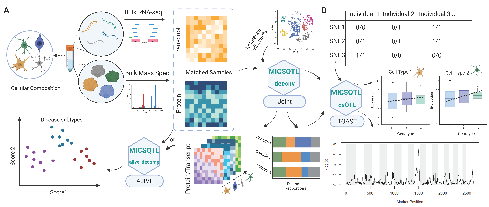

```{r set, echo = FALSE}
knitr::opts_chunk$set(
    collapse = TRUE,
    comment = "#>"
)
```

# Introduction

Our pipeline, `MICSQTL`, utilizes scRNA-seq reference and bulk transcriptomes to estimate cellular composition in the matched bulk proteomes. The expression of genes and proteins at either bulk level or cell type level can be integrated by Angle-based Joint and Individual Variation Explained (AJIVE) framework. Meanwhile, `MICSQTL` can perform cell-type-specic quantitative trait loci (QTL) mapping to proteins or transcripts based on the input of bulk expression data and the estimated cellular composition per molecule type, without the need for single cell sequencing.  We use matched transcriptome-proteome from human brain frontal cortex tissue samples to demonstrate the input and output of our tool. 




## Install

```{r setup, message  = FALSE, warning  = FALSE}
# Install
# options(download.file.method = "wininet")
# devtools::install_github("YuePan027/MICSQTL")
library(MICSQTL)
library(reshape2)
library(RColorBrewer)
library(GGally)
library(ggplot2)

```

# Quick start

A `SummarizedExperiment` object with bulk protein and/or gene expression
contained in `counts` slot, and a “signature matrix” which serves as a
reference of known cell type markers contained as an element in
`metadata` slot is required as input file. We recommend including 
important marker proteins or genes in the signature matrix to obtain more 
reliable results.

In this package, we provide an example `SummarizedExperiment` object containing 
the following elements:

- protein_data: A subset of proteomic data PsychENCODE with 2242 rows 
 (protein) and 127 columns (sample).

- anno_protein: A data frame with 2242 rows and 4 columns 
(Chr, Start, End, Symbol) as annotations of each protein from `protein_data`.
 
- ref_protein: A signature matrix with 2242 rows (protein) and  4 columns 
(cell types), which serves as a reference of known  cellular signatures.

- gene_data: A data frame with 2867 rows (genes) and 127 columns (sample).
   
- ref_gene: A signature matrix with 4872 rows (genes) and 5 columns 
(cell types), which serves as a reference of known cellular signatures.
   
- SNP_data: A sparse matrix with 2000 rows (SNP), which stores the information 
of genetic variants at each location from one chromosome and 127 columns 
(sample, should match the sample in `protein_data`). Each matrix entry 
corresponds to the genotype group indicator (0, 1 or 2) for a sample at a 
genetic location.
   
- anno_SNP: A data frame with 2000 rows and 3 columns (CHROM, POS, ID), 
which stores Annotations of each SNP from `SNP_data`.
   
- meta:A data frame with 127 rows (sample) and 2 columns 
(disease status and gender) as metadata.

```{r obj}
data(se)
```

## Cell-type proportion deconvolution

This step estimates cell type proportions per molecule type.

In this current version, only `CIBERSORT` and `nnls` are supported as single-source deconvolution methods.

```{r deconv1, results=FALSE}
se <- deconv(se, source = "protein", method = "cibersort")
```

This step might take a while if there are many features
in the signature matrix. The cell-type proportion estimates for each
sample will be stored as an element (`prop`) in `metadata` slot.

```{r deconv2, fig.width=7, fig.height=5, warnings = FALSE}
head(slot(se, "metadata")$prop)
```

```{r plot1, echo  = FALSE, warning  = FALSE}
mycolors1 <- brewer.pal(5, "Set2")[c(2, 1, 5, 3, 4)]
ggplot(
    cbind(data.frame(melt(slot(se, "metadata")$prop), slot(se, "metadata")$meta)),
    aes(x = Var2, y = value, fill = Var2)
) +
    geom_point(
        position = position_jitterdodge(
            jitter.width = 0.1,
            dodge.width = 0.7
        ),
        aes(fill = Var2, color = Var2),
        pch = 21, alpha = 0.5
    ) +
    geom_boxplot(lwd = 0.7, outlier.shape = NA) +
    theme_classic() +
    facet_wrap(~disease) +
    scale_fill_manual(values = mycolors1[c(1, 2, 4, 5)]) +
    xlab("Cell type") +
    ylab("Estimated proportion") +
    theme(legend.position = "none")
```

Alternatively, if there are cell-type proportion estimates results generated using other methods or obtained from other sources, just save that as an element (`prop`) in `metadata` slot and this deconvolution step can be skipped. Note that the samples in the cell-type proportion estimates must match the samples from bulk protein expression data.


## Cross-source cell-type proportion deconvolution (optional)

The pure cell proteomics reference matrix may be lacking due to the limitations 
in single cell proteomics technologies. Here, we provide cross-source cell-type fraction
deconvolution based on matched bulk transcriptome-proteome. In
the example below, we show how to estimate protein proportions by borrowing 
information from deconvoluted transcriptomes. 

```{r cross, message  = FALSE, warning  = FALSE, results=FALSE}
se <- deconv(se, source = "cross", method = "cibersort")
```

```{r plot2, echo  = FALSE, warning  = FALSE}
ggplot(
    cbind(data.frame(melt(slot(se, "metadata")$prop), slot(se, "metadata")$meta)),
    aes(x = Var2, y = value, fill = Var2)
) +
    geom_point(
        position = position_jitterdodge(
            jitter.width = 0.1,
            dodge.width = 0.7
        ),
        aes(fill = Var2, color = Var2),
        pch = 21, alpha = 0.5
    ) +
    geom_boxplot(lwd = 0.7, outlier.shape = NA) +
    theme_classic() +
    facet_wrap(~disease) +
    scale_fill_manual(values = mycolors1) +
    xlab("Cell type") +
    ylab("Estimated proportion") +
    theme(legend.position = "none")
```


## Integrative analysis

AJIVE (Angle based Joint and Individual Variation Explained) is useful when there are multiple data matrices measured on the same set of samples. It decomposes each data matrix as three parts: (1) Joint variation across data types (2) Individual structured variation for each data type and (3) Residual noise. 

It is similar as principal component analysis (PCA), but principal component analysis only takes a single data set and decomposes it into modes of variation that maximize variation. AJIVE finds joint modes of variation from multiple data sources. 

Common normalized scores are one of the desirable output to explore the joint behavior that is shared by different data sources. Below we show the visualization of common normalized scores. It is clear that the disease status of these samples are well separated by the first common normalized scores.

```{r ajive}
se <- ajive_decomp(se, use_marker = TRUE)
cns_plot(se,
    score = "cns_1", group_var = "disease",
    scatter = TRUE, scatter_x = "cns_1", scatter_y = "cns_2"
)
```

### Comparison to PCA

```{r pca}
pca_res <- prcomp(t(assay(se)), rank. = 3, scale. = FALSE)
pca_res_protein <- data.frame(pca_res[["x"]])
pca_res_protein <- cbind(pca_res_protein, slot(se, "metadata")$meta$disease)
colnames(pca_res_protein)[4] <- "disease"
ggpairs(pca_res_protein,
    columns = seq_len(3), aes(color = disease, alpha = 0.5),
    upper = list(continuous = "points")
) + theme_classic()


pca_res <- prcomp(t(slot(se, "metadata")$gene_data), rank. = 3, scale. = FALSE)
pca_res_gene <- data.frame(pca_res[["x"]])
pca_res_gene <- cbind(pca_res_gene, slot(se, "metadata")$meta$disease)
colnames(pca_res_gene)[4] <- "disease"
ggpairs(pca_res_gene,
    columns = seq_len(3), aes(color = disease, alpha = 0.5),
    upper = list(continuous = "points")
) + theme_classic()
```


## Feature filtering

The feature filtering can be applied at both proteins/genes and SNPs. This step is optional but highly recommended to filter out some features that are not very informative or do not make much sense biologically. Note that this function is required to run even no filtering is expected to be done (just set `filter_method = "null"`) to obtain a consistent object format for downstream analysis.

To apply feature filtering, annotation files for protein/gene and SNPs are required. The annotation file for proteins/genes should be stored in `rowData()`, where each row corresponds to a protein/gene with it’s symbol as row names. The first column should be a character vector indicating which chromosome each protein or gene is on. In addition, it should contain at least a “Start” column with numeric values indicating the start position on that chromosome, a “End” column with numeric values indicating the end position on that chromosome and a “Symbol” column as a unique name for each protein or gene.

```{r filter1}
head(rowData(se))
```

The information from genetic variants should be stored in a P (the number of SNP) by N (the number of samples, should match the sample in `counts` slot) matrix contained as an element (`SNP_data`) in `metadata` slot. Each matrix entry corresponds to the genotype group indicator (0 for 0/0, 1 for 0/1 and 2 for 1/1) for a sample at a genetic location. The annotations of these SNP should be stored as an element (`anno_SNP`) in `metadata` slot. It should include at least the following columns: (1) “CHROM” (which chromosome the SNP is on); (2) “POS” (position of that SNP) and (3) “ID” (a unique identifier for each SNP, usually a combination of chromosome and its position).

The example SNP data provided here were restricted to chromosome 9 only. In practice, the SNPs may from multiple or even all chromosomes.

```{r filter2}
head(slot(se, "metadata")$anno_SNP)
```

For filtering at protein or gene level, only those symbols contained in `target_SNP` argument will be kept and if not provided, all SNPs will be used for further filtering.

For filtering at SNP level, there are three options: (1) filter out the SNPs that have minor allele frequency below the threshold defined by `filter_allele` argument (`filter_method = "allele"`); (2) filter out the SNPs that the fraction of samples in the smallest genotype group below the threshold defined by `filter_geno` argument (`filter_method = "allele"`) and (3) restrict to cis-regulatory variants (`filter_method = "distance"`): the SNPs up to 1 Mb proximal to the start of the gene. Both filtering methods can be applied simultaneously by setting `filter_method = c("allele", "distance")`.

The results after filtering will be stored as an element (`choose_SNP_list`) in `metadata` slot. It is a list with the length of the number of proteins for downstream analysis. Each element stores the index of SNPs to be tested for corresponding protein. The proteins with
no SNPs correspond to it will be removed from the returned list.

To simplify the analysis, we only test 3 targeted proteins from
chromosome 9 as an example.


```{r filter3}
target_protein <- rowData(se)[rowData(se)$Chr == 9, ][seq_len(3), "Symbol"]
se <- feature_filter(se,
    target_protein = target_protein,
    filter_method = c("allele", "distance"),
    filter_allele = 0.15,
    filter_geno = 0.05,
    ref_position = "TSS"
)
```

In this example, the number of SNPs corresponding to each protein after filtering ranges from 7 to 26.

```{r filter4}
unlist(lapply(slot(se, "metadata")$choose_SNP_list, length))
```


## csQTL analysis

In this step, the `TOAST` method is implemented for cell-type-specific differential expression analysis based on samples’ genotype.

The result will be stored as an element (`TOAST_output`) in `metadata` slot. It is a list with the same length as tested proteins or genes where each element consists of a table including protein or gene symbol, SNP ID and p-values from each cell type. A significant p-value indicates that the protein or gene expression is different among the sample from
different genotype groups.

```{r csQTL1}
system.time(se <- csQTL(se))
```

We can check the results from csQTL analysis for one of target proteins:

```{r csQTL2}
res <- slot(se, "metadata")$TOAST_output[[2]]
head(res[order(apply(res, 1, min)), ])
```


## TCA tensor deconvolution 

The cell-type-specific expression per bulk sample can be predicted
using `TCA` deconvolution method given cellular composition (stored as
`prop` in `metadata`). The output will be stored as an element
(`TCA_deconv`) in `metadata` slot. It is a list with the length of the
number of cell types (same as cell types in `prop` in `metadata` slot).
Each element stores a deconvoluted protein expression per bulk sample.
Below is an example to check the deconvoluted cellular expression for
the first cell type (restricted to first 5 proteins and first 5
samples):

```{r tca, message=FALSE}
se <- TCA_deconv(se, prop = slot(se, "metadata")$prop)
slot(se, "metadata")$TCA_deconv[["Astro"]][seq_len(5), seq_len(5)]
```

The figure below depict the cell-type-specific expression in one example protein.

```{r cs}
res <- slot(se, "metadata")$TCA_deconv
idx <- which(rownames(assay(se)) == "ABCA2")
df_res <- do.call("cbind", lapply(seq_len(length(res)), function(i) {
    df <- data.frame(t(res[[i]][idx, , drop = FALSE]))
    colnames(df) <- names(res)[i]
    return(df)
}))
idx <- which(slot(se, "metadata")$anno_SNP$ID == "9:137179658")
table(slot(se, "metadata")$SNP_data[idx, ])
```

```{r plot3, echo  = FALSE}
ggplot(
    data.frame(melt(data.frame(cbind(df_res, genotype = slot(se, "metadata")$SNP_data[idx, ])), id.vars = c("genotype"))),
    aes(x = factor(genotype), y = value, fill = variable)
) +
    geom_point(
        position = position_jitterdodge(
            jitter.width = 0.1,
            dodge.width = 0.7
        ),
        aes(fill = variable, color = variable),
        pch = 21, alpha = 0.5
    ) +
    geom_boxplot(lwd = 0.7, outlier.shape = NA) +
    theme_classic() +
    facet_wrap(~variable, scales = "free") +
    scale_fill_manual(values = mycolors1) +
    xlab("Genotype") +
    ylab("Deconvoluted expression") +
    theme(legend.position = "none")
```

Such patterns may not be profound at bulk level.

```{r bulk}
df <- assay(se)
df <- df[which(rownames(df) == "ABCA2"), ]
df_test <- data.frame(
    value = as.vector(t(df)),
    genotype = slot(se, "metadata")$SNP_data[idx, ]
)
```

```{r plot4, echo = FALSE}
ggplot(
    df_test,
    aes(x = factor(genotype), y = value)
) +
    geom_jitter(pch = 21, alpha = 0.5) +
    geom_boxplot(lwd = 0.7, outlier.shape = NA) +
    theme_classic() +
    xlab("Genotype") +
    ylab("Deconvoluted expression")
```


# Licenses of the analysis methods

| method                                                                 | citation                                                                                                                                                                                                 |
|------------------------------------------------------------------------|----------------------------------------------------------------------------------------------------------------------------------------------------------------------------------------------------------|
| [CIBERSORT](https://cibersort.stanford.edu/)                           | Newman, A. M., Liu, C. L., Green, M. R., Gentles, A. J., Feng, W., Xu, Y., … Alizadeh, A. A. (2015). Robust enumeration of cell subsets from tissue expression profiles. Nature Methods, 12(5), 453–457. |
| [TCA](https://cran.r-project.org/web/packages/TCA/index.html)          | Rahmani, Elior, et al. “Cell-type-specific resolution epigenetics without the need for cell sorting or single-cell biology.” Nature communications 10.1 (2019): 3417.                                    |
| [AJIVE](https://github.com/idc9/r_jive)                                | Feng, Qing, et al. “Angle-based joint and individual variation explained.” Journal of multivariate analysis 166 (2018): 241-265.                                                                         |
| [TOAST](http://bioconductor.org/packages/release/bioc/html/TOAST.html) | Li, Ziyi, and Hao Wu. “TOAST: improving reference-free cell composition estimation by cross-cell type differential analysis.” Genome biology 20.1 (2019): 1-17. 


# Session info {.unnumbered}

```{r sessionInfo, echo=FALSE}
sessionInfo()
```


