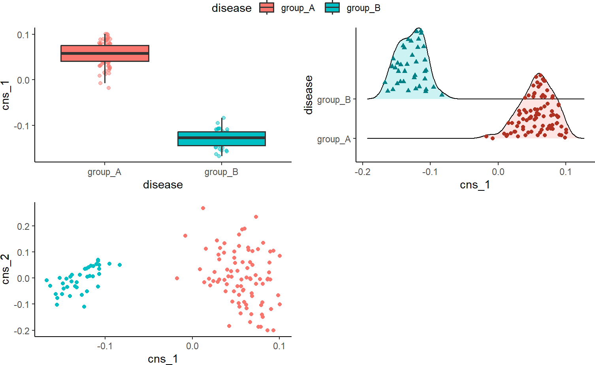

    
```{r set, echo = FALSE}
knitr::opts_chunk$set(
    collapse = TRUE,
    comment = "#>"
)
```

# Introduction

Our pipeline, `MICSQTL`, integrates RNA and protein expressions to detect potential cell marker proteins and estimate cell abundance in mixed proteomes without a reference signature matrix. `MICSQTL` enables cell-type-specific quantitative trait loci (QTL) mapping for proteins or transcripts using bulk expression data and estimated cellular composition per molecule type, eliminating the necessity for single-cell sequencing. We use matched transcriptome-proteome from human brain frontal cortex tissue samples to demonstrate the input and output of our tool.


# Install MICSQTL

```{r setup, message = FALSE, warning = FALSE, eval = FALSE}
if (!require("BiocManager", quietly = TRUE))
    install.packages("BiocManager")
BiocManager::install("MICSQTL")
```

# Load packages

```{r lib, message = FALSE, warning = FALSE}
library(MICSQTL)
```

Load packages for making plots.

```{r lib2, message = FALSE, warning = FALSE, eval = FALSE}
library(reshape2)
library(GGally)
library(ggplot2)
```

# Quick start

To conduct the analysis, you'll need to start with a `SummarizedExperiment` object that contains bulk protein expression data in the `assays` slot. The row metadata (`rowData` slot) should contain information about the proteins. Additionally, you'll require bulk gene expression data and a reference file (depends on the method you're using) included as elements in the `metadata` slot. For more accurate cell-type fraction estimations, it's recommended to include marker genes only. 

This code chunk assumes that you already have a bulk protein matrix named "protein_data" and annotation information for proteins called "anno_protein." The gene expression data is stored in "gene_data." 

```{r eg, eval = FALSE}
se <- SummarizedExperiment(
    assays = list(protein = protein_data),
    rowData = anno_protein
)
metadata(se) <- list(
    gene_data = gene_data
)
```

Further information is necessary for visualization and csQTL (cell-type specific quantitative trait loci) analysis. Additional metadata can be incorporated later using a command like `metadata(se)$new_data <- new_data` if needed. For detailed instructions, please refer to the following sections and function documentation.

In this package, we provide an example `SummarizedExperiment` object containing the following elements:
    
-   protein_data: A subset of proteomic data PsychENCODE with 2,242 rows (protein) and 127 columns (sample).

-   anno_protein: A data frame with 2,242 rows and 4 columns (Chr, Start, End, Symbol) as annotations of each protein from `protein_data`.

-   ref_protein: A signature matrix with 2,242 rows (protein) and 4 columns (cell types), which serves as a reference of known cellular signatures.

-   gene_data: A data frame with 2,867 rows (genes) and 127 columns (sample).

-   ref_gene: A signature matrix with 4,872 rows (genes) and 5 columns (cell types), which serves as a reference of known cellular signatures.

-   prop_gene: A pre-defined deconvoluted transcriptome proportion matrix.

-   SNP_data: A sparse matrix with 2,000 rows (SNP), which stores the information of genetic variants at each location from one chromosome and 127 columns (sample, should match the sample in `protein_data`). Each matrix entry corresponds to the genotype group indicator (0, 1 or 2) for a sample at a genetic location.

-   anno_SNP: A data frame with 2,000 rows and 3 columns (CHROM, POS, ID), which stores Annotations of each SNP from `SNP_data`.

-   meta:A data frame with 127 rows (sample) and 2 columns (disease status and gender) as metadata.

-   cell_counts: A matrix containing cell counts across multiple subjects, where subjects are represented as rows and cell types as columns. Each entry 
(i, j) in the matrix indicates the count of cells belonging to the ith 
subject and jth cell type.

```{r obj}
data(se)
```


## Cell-type proportion deconvolution

This step estimates cell type proportions per molecule type.

In this current version, only `nnls` is supported as single-source deconvolution methods.

Alternatively, if there are cell-type proportion estimates results generated using other methods or obtained from other sources, just save that as an element (`prop`) in `metadata` slot and this deconvolution step can be skipped. Note that the samples in the cell-type proportion estimates must match the samples from bulk protein expression data.

## Cross-source cell-type proportion deconvolution

The reference matrix for pure cell proteomics may be incomplete due to the limitations of single-cell proteomics technologies. To address this, we propose a novel cross-source cell-type fraction deconvolution method (Joint-AJ-RF) that leverages matched bulk transcriptome-proteome data. In the following example, we demonstrate how to estimate protein proportions by utilizing information from deconvoluted transcriptomes.

This method requires an external reference with cell counts from a similar tissue type (usually from small-scale single-cell or flow cytometry experiments). We provide a sample cell counts table in the metadata for illustration; however, in practice, it should be sourced from a matching tissue type.

The `ajive_decomp` function (more on this in the following section) with `refactor_loading = TRUE` should be employed to improve joint deconvolution by performing cross-source feature selection for potential protein cell markers.

```{r cross, message = FALSE, warning = FALSE, results = FALSE, eval = FALSE}
se <- ajive_decomp(se, use_marker = FALSE, refactor_loading = TRUE)
se <- deconv(se, source = "cross", method = "Joint",
             use_refactor = 1000, cell_counts = se@metadata$cell_counts)
```

```{r plot2, echo = FALSE, warning = FALSE, eval = FALSE}
ggplot(
    cbind(data.frame(melt(metadata(se)$prop), metadata(se)$meta)),
    aes(x = Var2, y = value, fill = Var2)
) +
    geom_point(
        position = position_jitterdodge(
            jitter.width = 0.1,
            dodge.width = 0.7
        ),
        aes(fill = Var2, color = Var2),
        pch = 21, alpha = 0.5
    ) +
    geom_boxplot(lwd = 0.7, outlier.shape = NA) +
    theme_classic() +
    facet_wrap(~disease) +
    xlab("Cell type") +
    ylab("Estimated proportion") +
    theme(legend.position = "none")
```


An alternative approach involves a two-step process. First, obtain a sample-wise pre-defined deconvoluted transcriptome proportion and store as `prop_gene` in the `metadata` slot, use methods like CIBERSORT or MuSiC. Then, utilize the TCA algorithm (https://cran.r-project.org/web/packages/TCA/index.html) to calculate protein proportion estimates. 

## Integrative visualization

AJIVE (Angle based Joint and Individual Variation Explained) is useful when there are multiple data matrices measured on the same set of samples. It decomposes each data matrix as three parts: (1) Joint variation across data types (2) Individual structured variation for each data type and (3) Residual noise.

It is similar as principal component analysis (PCA), but principal component analysis only takes a single data set and decomposes it into modes of variation that maximize variation. AJIVE finds joint modes of variation from multiple data sources.

Common normalized scores are one of the desirable output to explore the joint behavior that is shared by different data sources. Below we show the visualization of common normalized scores. It is clear that the disease status of these samples are well separated by the first common normalized scores.

```{r ajive, eval = FALSE}
se <- ajive_decomp(se, plot = TRUE,
                   group_var = "disease",
                   scatter = TRUE, scatter_x = "cns_1", scatter_y = "cns_2")
metadata(se)$cns_plot
```



### Comparison to PCA

```{r pca}
pca_res <- prcomp(t(assay(se)), rank. = 3, scale. = FALSE)
pca_res_protein <- data.frame(pca_res[["x"]])
pca_res_protein <- cbind(pca_res_protein, metadata(se)$meta$disease)
colnames(pca_res_protein)[4] <- "disease"
```

```{r pcaplot, eval = FALSE}
ggpairs(pca_res_protein,
        columns = seq_len(3), aes(color = disease, alpha = 0.5),
        upper = list(continuous = "points")
) + theme_classic()


pca_res <- prcomp(t(metadata(se)$gene_data), rank. = 3, scale. = FALSE)
pca_res_gene <- data.frame(pca_res[["x"]])
pca_res_gene <- cbind(pca_res_gene, metadata(se)$meta$disease)
colnames(pca_res_gene)[4] <- "disease"
ggpairs(pca_res_gene,
        columns = seq_len(3), aes(color = disease, alpha = 0.5),
        upper = list(continuous = "points")
) + theme_classic()
```


## Feature filtering

The feature filtering can be applied at both proteins/genes and SNPs. This step is optional but highly recommended to filter out some features that are not very informative or do not make much sense biologically. Note that this function is required to run even no filtering is expected to be done (just set `filter_method = "null"`) to obtain a consistent object format for downstream analysis.

To apply feature filtering, annotation files for protein/gene and SNPs are required. The annotation file for proteins/genes should be stored in `rowData()`, where each row corresponds to a protein/gene with it's symbol as row names. The first column should be a character vector indicating which chromosome each protein or gene is on. In addition, it should contain at least a "Start" column with numeric values indicating the start position on that chromosome, a "End" column with numeric values indicating the end position on that chromosome and a "Symbol" column as a unique name for each protein or gene.

```{r filter1}
head(rowData(se))
```

The information from genetic variants should be stored in a P (the number of SNP) by N (the number of samples, should match the sample in `counts` slot) matrix contained as an element (`SNP_data`) in `metadata` slot. Each matrix entry corresponds to the genotype group indicator (0 for 0/0, 1 for 0/1 and 2 for 1/1) for a sample at a genetic location. The annotations of these SNP should be stored as an element (`anno_SNP`) in `metadata` slot. It should include at least the following columns: (1) "CHROM" (which chromosome the SNP is on); (2) "POS" (position of that SNP) and (3) "ID" (a unique identifier for each SNP, usually a combination of chromosome and its position).

The example SNP data provided here were restricted to chromosome 9 only. In practice, the SNPs may from multiple or even all chromosomes.

```{r filter2}
head(metadata(se)$anno_SNP)
```

For filtering at protein or gene level, only those symbols contained in `target_SNP` argument will be kept and if not provided, all SNPs will be used for further filtering.

For filtering at SNP level, there are three options: (1) filter out the SNPs that have minor allele frequency below the threshold defined by `filter_allele` argument (`filter_method = "allele"`); (2) filter out the SNPs that the fraction of samples in the smallest genotype group below the threshold defined by `filter_geno` argument (`filter_method = "allele"`) and (3) restrict to cis-regulatory variants (`filter_method = "distance"`): the SNPs up to 1 Mb proximal to the start of the gene. Both filtering methods can be applied simultaneously by setting `filter_method = c("allele", "distance")`.

The results after filtering will be stored as an element (`choose_SNP_list`) in `metadata` slot. It is a list with the length of the number of proteins for downstream analysis. Each element stores the index of SNPs to be tested for corresponding protein. The proteins with no SNPs correspond to it will be removed from the returned list.

To simplify the analysis, we only test 3 targeted proteins from chromosome 9 as an example.

```{r filter3}
target_protein <- rowData(se)[rowData(se)$Chr == 9, ][seq_len(3), "Symbol"]
se <- feature_filter(se,
    target_protein = target_protein,
    filter_method = c("allele", "distance"),
    filter_allele = 0.15,
    filter_geno = 0.05,
    ref_position = "TSS"
)
```

In this example, the number of SNPs corresponding to each protein after filtering ranges from 7 to 26.

```{r filter4}
unlist(lapply(metadata(se)$choose_SNP_list, length))
```

## csQTL analysis

In this step, the `TOAST` method is implemented for cell-type-specific differential expression analysis based on samples' genotype.

The result will be stored as an element (`TOAST_output`) in `metadata` slot. It is a list with the same length as tested proteins or genes where each element consists of a table including protein or gene symbol, SNP ID and p-values from each cell type. A significant p-value indicates that the protein or gene expression is different among the sample from different genotype groups.

```{r csQTL1, eval = FALSE}
system.time(se <- csQTL(se))
```

We can check the results from csQTL analysis for one of target proteins:
    
```{r csQTL2, eval = FALSE}
res <- metadata(se)$TOAST_output[[2]]
head(res[order(apply(res, 1, min)), ])
```


# Licenses of the analysis methods

| method                                                                 | citation                                                                                                                                                              |
|------------------------------------------------------------------------|-----------------------------------------------------------------------------------------------------------------------------------------------------------------------|
| [TCA](https://cran.r-project.org/web/packages/TCA/index.html)          | Rahmani, Elior, et al. "Cell-type-specific resolution epigenetics without the need for cell sorting or single-cell biology." Nature communications 10.1 (2019): 3417. |
| [AJIVE](https://github.com/idc9/r_jive)                                | Feng, Qing, et al. "Angle-based joint and individual variation explained." Journal of multivariate analysis 166 (2018): 241-265.                                      |
| [TOAST](http://bioconductor.org/packages/release/bioc/html/TOAST.html) | Li, Ziyi, and Hao Wu. "TOAST: improving reference-free cell composition estimation by cross-cell type differential analysis." Genome biology 20.1 (2019): 1-17.       |

# Session info {.unnumbered}

```{r sessionInfo, echo=FALSE}
sessionInfo()
```
